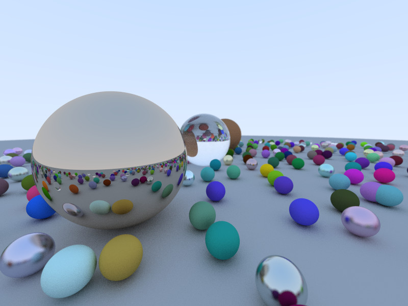
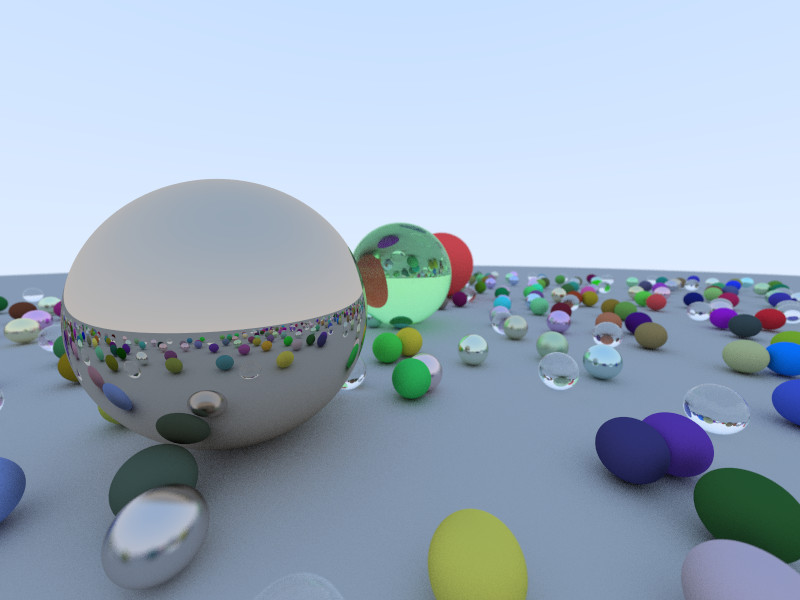
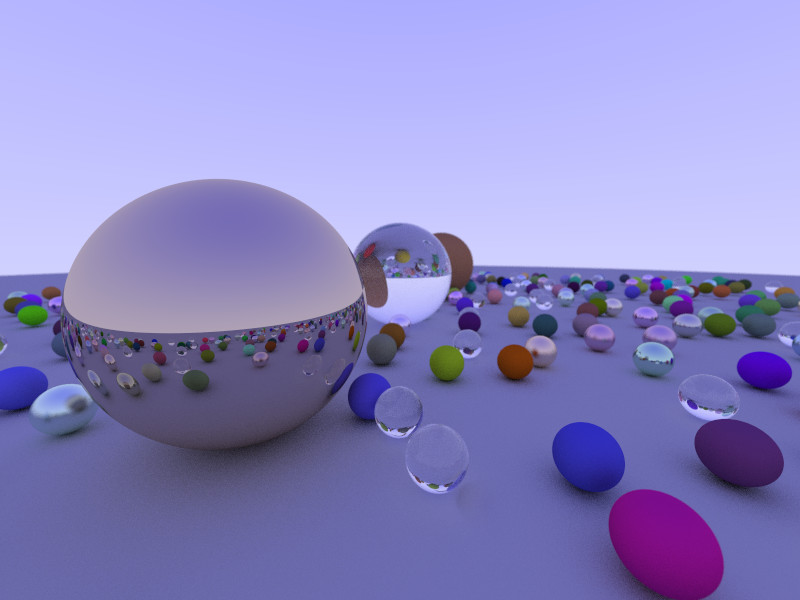
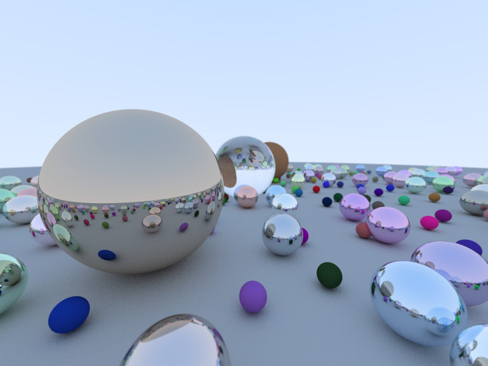

# ray-tracing-series
A ray tracer implementation based on the **Ray Tracing in One Weekend Book Series** by Peter Shirley - https://raytracing.github.io/

More output examples are available [here](#output-examples).

# Overview
This implementation is based on C++ 11. It covers the content of the first book **Ray Tracing in One Weekend**. The 2 other ones haven't been covered yet: **Ray Tracing the Next Week** and **Ray Tracing the Rest of Your Life**.

The execution follows 3 main steps (see [main.cpp](ray-tracing-series/src/main.cpp) > *main()*):
 1. Setting up the world
 2. Performing ray tracing
 3. Writing the image file

The first step generates a world with a giant sphere for the ground, 3 bigger spheres in the center and approximately 500 smaller spheres with a random mix of materials: diffuse, metallic and dielectric (glass). It also sets up the camera.

The second step performs the ray tracing itself. At the moment the implementation is CPU-based but it has been fully multithreaded. A number of async tasks are launched, each responsible for ray tracing a certain number of the image's lines.

The third and last step simply outputs the resulting image buffer to a PPM file.

# Observations

Detailed comments have been added to the following algorithms:
 * Ray/Sphere intersection (see [sphere.cpp](ray-tracing-series/src/sphere.cpp) > *Sphere::hit* comments at the bottom of the file)
 * Vector refraction (see [utils.cpp](ray-tracing-series/src/utils.cpp) > *getRefractedVector*) based on [the following post](http://psgraphics.blogspot.com/2015/06/ray-tracing-refraction.html)
 * Dielectric scattering (see [dielectric.cpp](ray-tracing-series/src/dielectric.cpp) > *Dielectric::scatter*)

It's important to note that the dielectric scattering as described in **Chapter 9: Dielectrics** is incorrect. More precisely, the computation of the cosine parameter which is passed to Schlick's approximation. The correct one can be found in [the following post](http://psgraphics.blogspot.com/2016/03/my-buggy-implimentation-of-schlick.html) from Peter Shirley.

The implementation suggested by this post can lead to *NaNs* caused by a *sqrt(negative_value)*. It's not easily noticeable since the visual impact is somewhat limited. Also the *NaN* value doesn't propagate to the rest of the ray tracing algorithm since this value is only used locally to determine whether the ray is refracted or reflected. Either way, in the case of a negative value the ray should simply be reflected, this is a case of total internal reflection.

# Configuration

A number of defines and configuration constants can be adjusted.

The following defines can be added to the *Preprocessor Definitions* (see [defines.h](ray-tracing-series/src/defines.h)):
 * MULTITHREADING_ON: to activate the multithreading support
 * DETERMINISTIC_RNG: to render identical images given the same input (fixed random seeds even in multithread)
 * RENDER_NORMAL_MAP: to render the normal map of the scene (it's fast to execute because a ray is cast to get the normal but it isn't scattered)
 * RENDER_NO_MATERIAL: to render the image ignoring the objects material (the rays bounce with a simple reflection, there's no material so no color, refraction etc.)
 * RENDER_GRAYSCALE: to render the grayscale image of the scene

The following constants can also be adjusted (see [config.h](ray-tracing-series/src/config.h)):
 * IMAGE_WIDTH / IMAGE_HEIGHT: the image resolution
 * IMAGE_GAMMA_CORRECTION: the gamma correction to apply
 * CAMERA_FOV: the camera field of view
 * RAY_COUNT_PER_PIXEL: the number of rays traced to generate one pixel
 * RAY_DEPTH_MAX: the maximum of times a ray gets to bounce
 * MULTITHREADING_SUBTASK_COUNT: the number of tasks spawned by the ray tracer

There's more but these are the main ones.

# Output examples

Those output examples have been generated with the following configuration:
 * IMAGE_WIDTH / IMAGE_HEIGHT = 800 x 600
 * RAY_COUNT_PER_PIXEL = 150
 * RAY_DEPTH_MAX = 20

Each run took approximately 130 seconds to generate on the 8 threads of an Intel Core i7-6700K Quad Core 4GHz processor.

Those images all feature the setup mentioned earlier but here are some interesting characteristics:
 1. In the first example, the bigger sphere in the foreground is made out of smooth metal (fuzz factor = 0), while some of the smaller spheres are made out of brushed metal (fuzz factor > 0) (see [metal.h](ray-tracing-series/src/metal.h) > fuzziness *m_fuzz*)
 2. In the second one, the bigger glass sphere in the center is tainted green and more of the smaller spheres are made out of glass (see [dielectric.h](ray-tracing-series/src/dielectric.h)). It's interesting to see how the refraction flips the image of whatever is behind the glass
 3. In the third one, the background color has been changed to a darker blue (see [config.h](ray-tracing-series/src/config.h) > *WORLD_BACKGROUND_COLOR_TOP* and *WORLD_BACKGROUND_COLOR_BOTTOM*) which affects the entire scene
 4. In the fourth one, more of the spheres are made out of smooth metal featuring even more reflection while the smaller spheres are made out of diffuse material (see [lambertian.h](ray-tracing-series/src/lambertian.h))

